# شروع با FontForge

مقدمه:
برای طراحی قلم ابتدا باید با دانش طراحی قلم آشنا باشید. این دانش را می‌توانید در دوره‌های تخصصی یا رشته‌های دانشگاهی مرتبط تحت نظر اساتید مجرب تحصیل نمایید. هر تایپ‌فیس برای طراحی دست کم چند ماه زمان نیاز دارد که بسته به پیچیدگی می‌تواند تا چند سال هم به طول بینجامد. اکیدا توصیه می‌شود دانش و مهارت طراحی قلم را به صورت اصولی فرا بگیرید قبل از آنکه در این وادی شیرجه بزنید.

این راهنمای کوتاه و سریع تنها گوشه‌ای از نحوه کار با نرم‌افزار فونت‌فورج را توضیح می‌دهد تا با نمای کلی آن آشنا شوید. در واقع پیش از آن شما باید مرحله نخست طراحی تایپ‌فیس یعنی اتود زدن بر روی کاغذ را درک کرده باشید و از آن تصاویر برای ایجاد اشکال دیجیتالی بهره بگیرید. این راهنما ممکن است دارای اشکالاتی هم باشد. همچنین نیاز است تا به انتها بخوانید. به ویژه قسمت پرسش و پاسخ.

[فونت‌فورج](https://fontforge.github.io) را که نصب کردید به سراغ یکی از صفحات فونت های آزاد رفته و پس از دریافت فایل سورس، آن را توسط فونت‌فورج باز کنید. برای شروع شاید [قلم وزیرمتن](https://raw.githubusercontent.com/rastikerdar/vazirmatn/master/sources/Vazirmatn-Regular.sfd) بد نباشد (لینک را دانلود یا ذخیره کنید).

## نمای نخست
[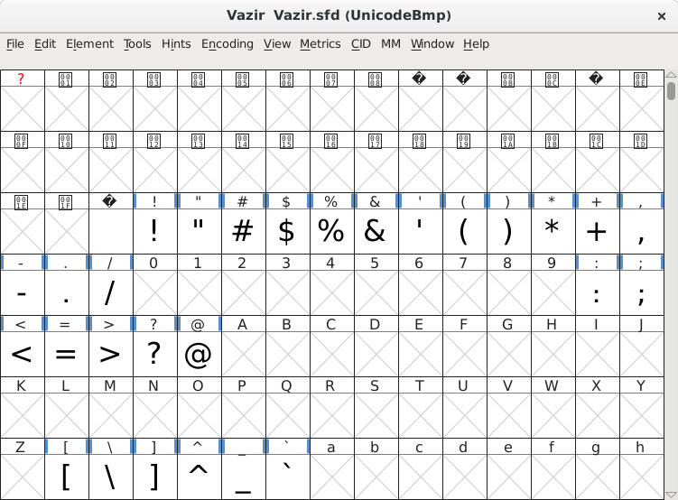](images/main-window.png)

اجازه دهید مروری بر موضوعات کلی داشته باشیم. به طور خیلی ساده و کلی زمانی که کامپیوتر می خواهد چیزی را نمایش دهد ابتدا کد آن را بررسی می‌کند که آیا در این جدولی که مشاهده می کنید وجود دارد (و البته خالی نمی باشد) یا خیر. اگر خیر به سراغ جداول فونت های دیگری می رود. آرایش این جدول بر اساس نوع انکدینگی است که در منوی Encoding انتخاب کرده‌ایم:

[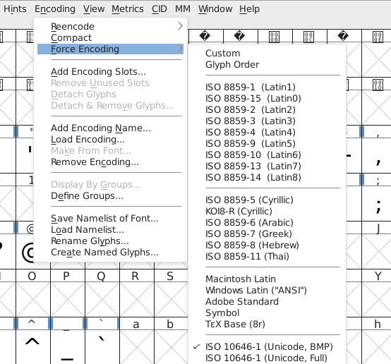](images/encoding.png)

در جدول اصلی هر کدام از این خانه ها را گلیف (Glyph) می‌نامیم. خانه هایی که به صورت X هستند عملا بدون استفاده می‌باشند و در فونت انکد نمی‌شوند یا به عبارتی در هنگام نمایش مورد استفاده قرار نمی‌گیرند. اگر هر کدام را باز کنید و تغییراتی درونش اعمال نمایید به طوری که از حالت X خارج شود حتما در هنگام نمایش کد مربوط به آن، مورد استفاده قرار خواهد گرفت. خواه خالی باشد خواه پر. اگر خواستید دوباره به حالت X برگردانید کافیست پس از انتخاب آن در جدول اصلی، از منوی Encoding گزینه Detach & Remove Glyphs را انتخاب نمایید تا کاملا از فونت حذف شود.

[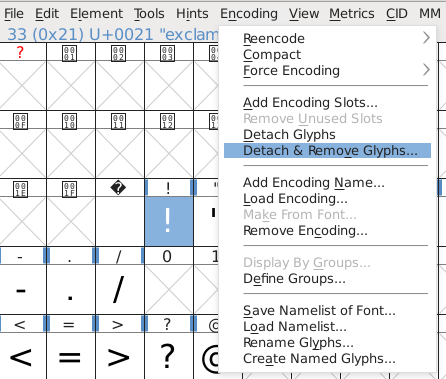](images/remove-glyph.png)

از آنجایی که پیدا کردن هر گلیف در این جدول بسیار بزرگ کمی مشکل است، از منوی Encoding گزینه Compact را بر می‌گزینیم.

[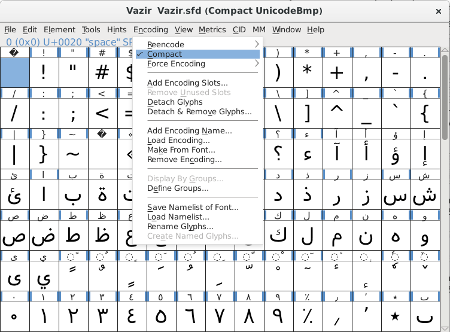](images/compact.png)

الان خیلی بهتر شد. جدولمان حسابی جمع و جور شد. برای شروع به سراغ یکی از گلیف ها یعنی دال با دو بار کلیک می رویم.

[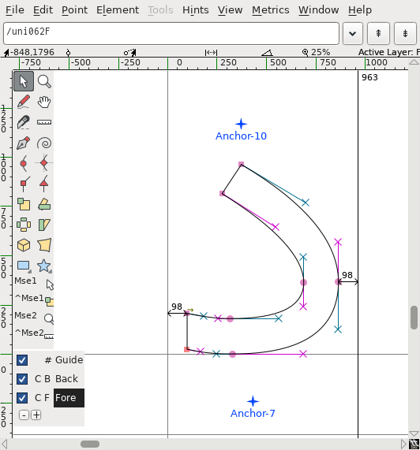](images/dal.png)

چند نکته:

- با کلیدهای ctrl+D می‌توانید Point ها یا همان نقاط که از این به بعد آن‌ها را گره‌ها می نامیم را ببینید یا پنهان کنید. این نامگذاری به دلیل اینکه بسیاری حروف فارسی دارای نقطه هستند انجام می‌دهیم.

- با انتخاب منوی View->Show->Fill می‌توانید گلیف را به صورت توپر یا توخالی ببینید.

[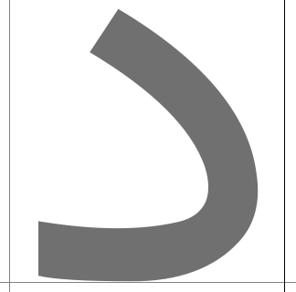](images/dal-filled.png)

- برای دیدن پیش نمایش گلیف مشابه نمایش در حالت نهایی کلیدهای ctrl+` یا منوی View->Show->Preview را انتخاب نمایید.

[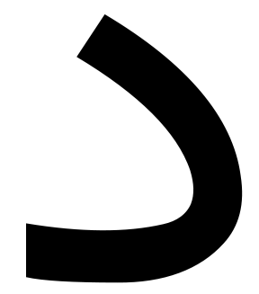](images/dal-preview.png)

- برای بزرگ و کوچک‌نمایی نیز کلیدهای ctrl+= یا از آن بهتر ctrl+غلتک موشی استفاده نمایید. (mouse=موشی، scroll=غلتک)
- برای بالا و پایین حرکت دادن صفحه فقط غلتک موشی.
- برای چپ و راست بردن صفحه نیز shift+غلتک موشی.

- برای Undo یعنی بازگشت به حالت قبل از آخرین تغییر در گلیف و یا Redo یعنی رفتن به حالت پس از تغییر بعدی به ترتیب دکمه های ctrl+Z و ctrl+Y را هرگز فراموش نکنید.

این چند مورد ساده بالا را دائما و به صورت غیر قابل شمارش در حال انجام دادن خواهید بود پس دانستن آنها خیلی کمکتان می‌کند.

**سوال**: چرا برخی گلیف‌ها را نمی توان ویرایش کرد یا برخی شکل‌ها گره‌ای برای ویرایش ندارند؟
برای پاسخ به بخش پرسش و پاسخ در انتهای مطلب مراجعه نمایید.

## متریک‌ها
در تصویر زیر پنج خط اصلی را مشاهده می‌کنید که در هر فونتی دو خط افقی بالا Ascender یا فراز و پایین Descender یا فرود نسبت به خط پایه یا Baseline بیانگر اندازه اصلی ارتفاع کل فونت یا گلیف‌ها با نام Em Size می‌باشد. در واقع این اندازه مربع یا Em Square است اما خب برای دانستن اصل ماجرا به کتب یا مقالات تخصصی آن مراجعه نمایید. این اندازه به واحد تعریف می‌شود که در زمان نمایش بسته به نوع و اندازه واحد مورد استفاده، تبدیل می‌شود. فرض کنید این اندازه ۱۰۰۰ واحد باشد و اندازه ارتفاع گلیف دال شما نیز ۶۰۰ واحد. حال اگر بخواهید قلم را در اندازه ۱۰ پیکسل نمایش دهید ارتفاع گلیف الف ۶ پیکسل خواهد بود. در قلم‌های truetype یا همین قلم وزیر این اندازه بر اساس توانی از دو در نظر گرفته می‌شود. در فونت وزیر اندازه Em دقیقا ۲۰۴۸ واحد و ارتفاع دال نیز حدودا ۹۰۰ و الف ۱۴۰۰ واحد می‌باشد. 

[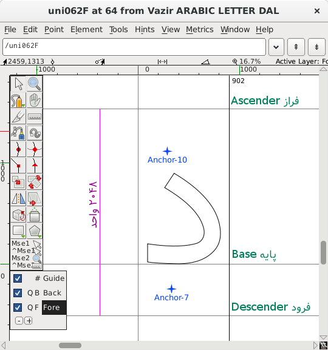](images/metrics.png)

نکته: در فونت وزیر ارتفاع هر کدام از گلیف‌ها صرفا بر اساس آنچه که به چشم خوانا و راحت آمد انتخاب شده‌اند و فرمول خاصی ندارد! :D

خط وسط یا پایه یا همان Baseline همانطور که از نامش پیداست خط پایه تمام گلیف‌هاست که هر کدام از گلیف ها به تناسب شکلشان در بالا یا پایین یا هر دو طرف قرار می‌گیرند.

تعیین اندازه Em Size در منوی Element->Font Info در برگه General صورت می‌گیرد. Em Size جمع Ascender و Descender می‌باشد.

[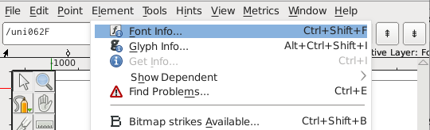](images/font-info-menu.png)

[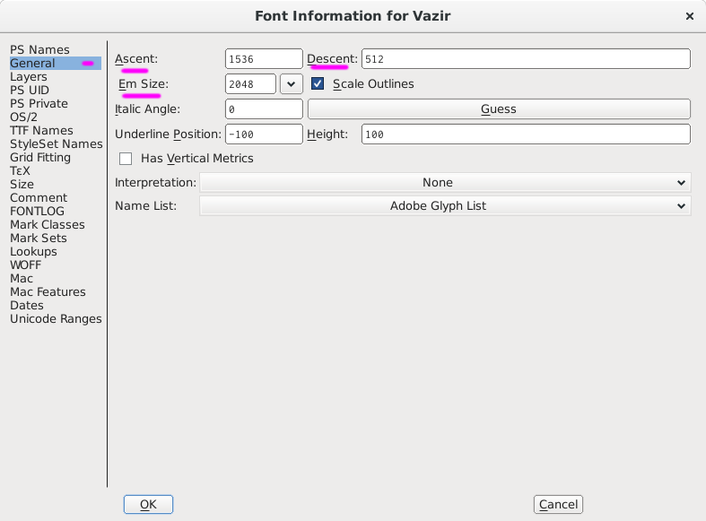](images/font-info-general.png)

قاعدتا اگر ارتفاع گلیف‌های شما از خط فراز یا فرود تجاوز کند آن قسمت نباید نمایش یابد. اما در برخی قلم‌ها می‌بینید گلیف ها از این محدوده خارج شده‌اند و بدون مشکل رندر می‌شوند. دلیلش تعیین پارامترهای دیگری در فونت تحت برگه OS/2->Metrics برای نحوه نمایش است که بالاتر از مقدار Em Size تعریف می‌گردند. خارج از این محدوده چیزی نمایش نمی‌یابد.

[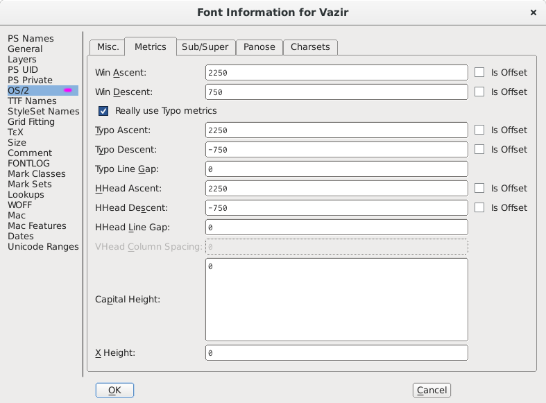](images/font-metrics.png)

دو خط عمودی نیز طول گلیف را مشخص می‌کنند. خط سمت راست، هم از طریق موشی و هم منوی Metrics->Set Width یا Metrics->RBearing قابل تغییر است. خط چپ نیز هم از طریق موشی هم از منوی Metrics->LBearing. توجه داشته باشید در صورت تغییر با موشی گلیف های وابسته به این گلیف که در ادامه توضیح خواهیم داد نیز تغییر می‌کنند. بهترین حالت انتخاب با موشی و چپ و راست نمودن با کلید های جهت دار > و < کیبورد است تا از تغییرات ناخواسته جلوگیری شود.

همیشه منوی View->Show->Side Bearings را فعال نگه دارید تا فاصله گلیف از چپ و راست نمایش یابد.

[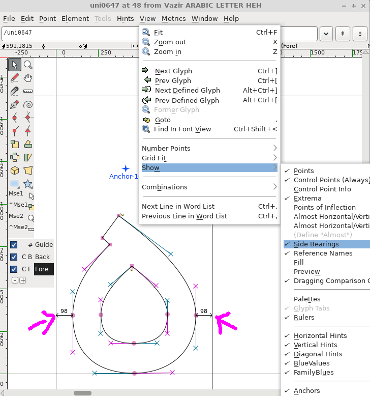](images/sides.png)

رعایت این فاصله در همه گلیف ها باعث خوانایی و نظم در نوشته‌ها می شود. انتخاب اندازه مناسب به شاخص‌های گوناگونی بستگی دارد که در فونت وزیر سعی گردیده نزدیک به ۹۰ واحد بماند. اگر شکل شما از این دو خط تجاوز کند در صورتی که فضای کافی برای نمایش آن وجود داشته باشد بدون مشکل نمایش می‌یابد. توصیه می‌شود چنین نشود مگر در یک حالت خاص رایج که توضیح آن در بخش پرسش و پاسخ در انتهای مطلب آمده است.

خطوط دیگری نیز می‌تواند در صفحه وجود داشته باشد که با کلیک موشی در خط کش افقی یا عمودی کنار صفحه و کشیدن در داخل صفحه می‌توانید به هر تعداد که خواستید خطوط راهنما یا کمکی یا همان Guide line بسازید. برای حذف این خطوط در قسمت پایین جعبه ابزار سمت چپ صفحه بر روی خود کلمه Guide کلیک کنید سپس با انتخاب هر کدام از خطوط می‌توانید آن را حذف کنید. و برای بازگشتن به حالت عادی کلمه Fore را کلیک کنید.

[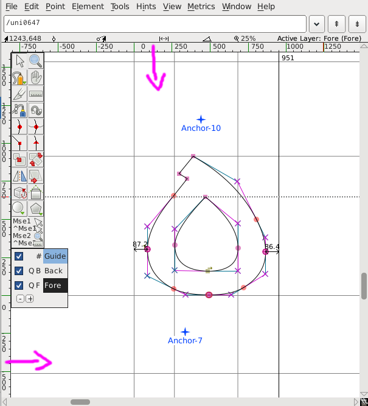](images/guide-lines.png)

نکته: گلیف هایتان را طوری بسازید که تا حد امکان فضای ما بین خط فراز و خط پایه را پر کند. اینگونه با گلیف ها و فونت های لاتین نیز هماهنگ خواهد بود. برای مثال ارتفاع الف را مساوی یا نزدیک به خط فراز در نظر بگیرید تا در ادامه طراحی سایر گلیف‌ها بتوان به اندازه ارتفاع الف استناد کرد.

دو ستاره موجود در تصویر نامشان Anchor است و مکان قرار گیری اعراب هستند. در فونت وزیر anchor-10 برای نمایش اعراب بالا مثل فتحه و ضمه و تنوین و ... و anchor-7 نیز جهت اعراب پایین مانند کسره. میتوانید در جای دلخواه قرار دهید. 

اکنون به مقوله جذاب ابزارهای طراحی می پردازیم. بسیار ساده است. سر و کار ما در هنگام طراحی تنها با گره‌ها می‌باشد. در واقع این گره‌های متصل به هم می‌باشند که شکل ما را می‌سازند.

## گره‌ها
چهار نوع گره داریم:

### گره منحنی یا Curve point
گره منحنی برای تعیین نحوه اتصالش با دیگر گره‌ها دو دستگیره دارد. این دو دستگیره به هم متصل می‌باشند و به بیانی دیگر نمی‌توانند از یکدیگر مستقل عمل کنند که دلیل آن ایجاد یک منحنی صاف در دو طرف می‌باشد.

### گره منحنی اچ وی یا افقی و عمودی یا H/V Curve point
این نوع گره منحنی تاکیدش بر چسبیدن به محور افقی و عمودی می‌باشد که در هنگام طراحی اشکال صحیح و اصولی به کمک می آید. توضیحات آن در ادامه مطلب خواهد آمد.

### گره گوشه یا Corner point
همانطور که از نامش پیداست گره‌هایی هستند که در گوشه قرار می‌گیرند. این نوع گره می‌تواند از هیچ یا یک و یا ۲ دستگیره برخوردار باشد که کاملا مستقل از یکدیگر عمل می‌کنند. به هر کدام از دستگیره ها که نیازی نداشتید یا عبارتی دنبال خط صاف بودید دستگیره را به داخل خود گره بکشید.

#### گره مماس یا Tangent point
برای داشتن یک منحنی کاملا مماس مطلوب (به صورت تضمین شده) در امتداد یک خط صاف حتما از این نوع گره استفاده نمایید. این گره فقط یک دستگیره باید داشته باشد (اگر دو تا داشت بسته به جهتی که مد نظرتان است یک دستگیره را به داخل خود فلش بکشید).

[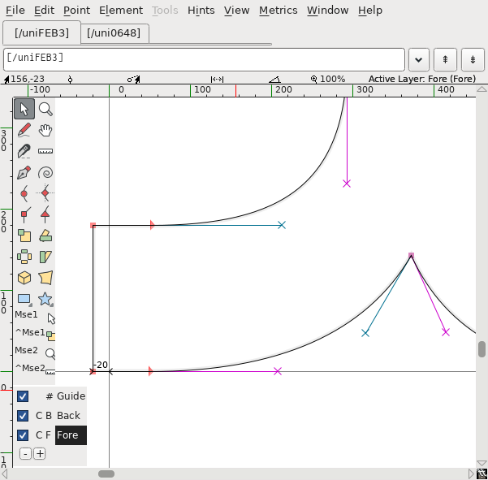](images/tangent-point-vazir.png)

برای مثال در قلم شبنم به کرات از این نوع گره استفاده شده است.

[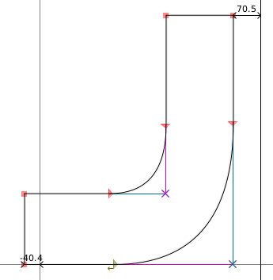](images/tangent-point-shabnam.png)

### روش صحیح طراحی:
برای داشتن منحنی‌های مناسب به طوری که هم کمترین تعداد گره را داشته باشیم و هم عمل Rasterization یا همان تبدیل این گره‌ها و خطوط برداری یا Vector به حالت گرافیک پیکسلی که در صفحات نمایش می‌بینیم به سهولت انجام پذیرد بهتر است تلاش کنیم که گره‌های منحنی کاملا در نقاط قوس یا انتهای انحنا قرار گیرند. این نقاط را خود فونت فورج به شکل یک دایره که با علامت + پر شده نشان می‌دهد. به این نقاط extrema می‌گویند. در ادامه توضیح خواهیم داد که چگونه این نقاط را پر کنیم.

[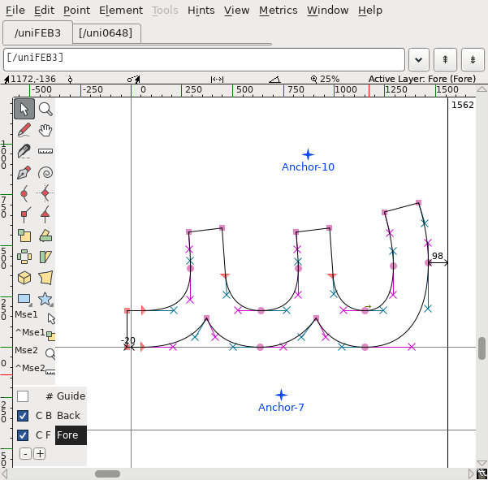](images/right-design.png)

**نکته:** فراموش نکنید که در منوی Element -> Font Info -> Layers گزینه All layers cubic رو انتخاب کرده باشید.

**نکته:** فاصله‌ها و اندازه‌ها (مختصات) را رند نمایید. برای اینکار بر روی گلیف مورد نظر کلیک راست و از منو گزینه To Int را انتخاب نمایید.

## کار با گره‌ها
در جعبه ابزار این چهار نوع گره را مشاهده می‌کنید. هر گاه که قصد داشتید گره‌ای را بر روی یک خط ایجاد کنید کافیست یکی از این چهار نوع را انتخاب نموده و در نقطه مورد نظر کلیک کنید. برای خروج از حالت ایجاد گره و بازگشت به حالت انتخاب گره، کلید V (وی انگلیسی) را فشار دهید یا دکمه موشی در جعبه ابزار را انتخاب کنید.

[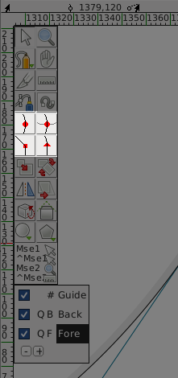](images/toolbox-points.png)

برای تغییر حالت هر گره، پس از گزینش آن، از منوی Point و یا با کلیک راست بر روی آن یکی از چهار حالت یا چهار گزینه نخست را انتخاب کنید.

[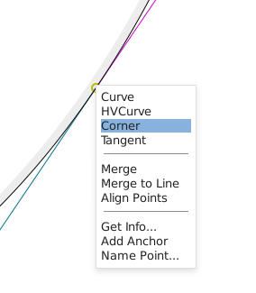](images/point-right-click-menu.png)

برای ادغام گره در خط یا به نوعی محو (حذف ادغامی) آن منوی Edit->Merge یا کلیدهای ctrl+M و یا کلیک راست گزینه Merge را انتخاب نمایید.

[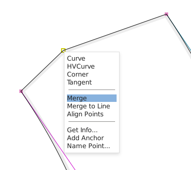](images/merge-point-before.png)

[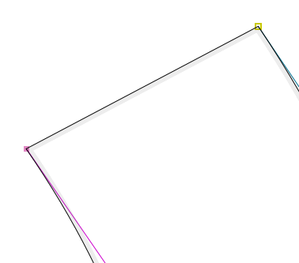](images/merge-point-after.png)

برای ایجاد خط صاف یا منحنی بین دو گره، پس از انتخاب هر دوی آنها، منوی Point->Make Line یا از منوی کلیک راست انتخاب نمایید.

[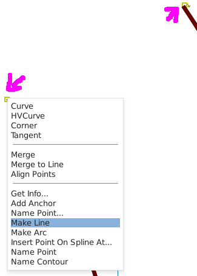](images/make-line-before.png)

[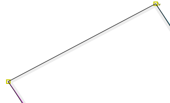](images/make-line-after.png)

برای ایجاد منحنی بین دو گره گوشه (corner) با خط صاف می توانید دکمه قلم یا Pen یا کلید P را فشار دهید. سپس در وسط خط کلیک کرده بکشید. یک گره منحنی با یک دستگیره ایجاد می‌شود. 

[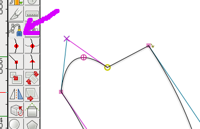](images/pen.png)

در صورتی که به هر دو دستگیره نیاز دارید با کلیک راست بر روی آن و انتخاب گزینه Get Info پنجره ای نمایش می‌یابد که در واقع تمامی مشخصات گره در آن گنجانده شده است. گزینه Interpolated و سپس OK را بزنید. در این پنجره همچنین به راحتی می توانید مختصات دقیق گره را نیز تعیین کنید.

[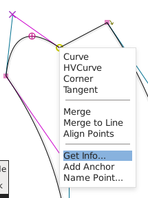](images/get-info-menu.png)

[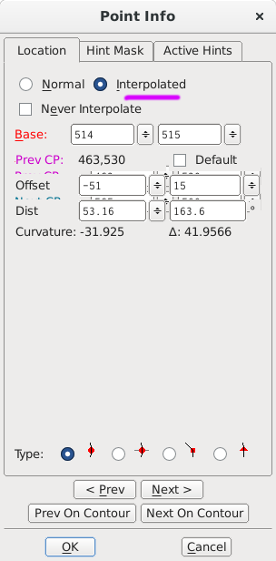](images/get-info.png)

### نقاط Extrema و حذف گره‌های اضافی
همانطور که گفتیم نقاط extrema مکان قوس یا انتهای انحنا می‌باشند که بهتر است گره‌های ما از نوع منحنی H/V در آنجا قرار گیرند. برای اضافه کردن این نوع گره‌ها کلید ctrl+shift+X یا منوی Element->Add Extrma را انتخاب کنیم.

[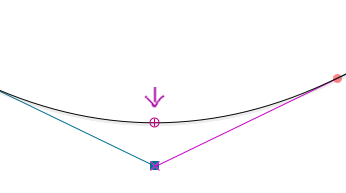](images/extrema.png)

همچنین برای حذف گره‌های اضافی یا به نوعی ساده سازی و تمیز کاری گلیف، کلید ctrl+shift+M یا منوی Element->Simplify->Simplify را انتخاب نمایید.

### عملیات تبدیلی-حرکتی
جهت انجام عملیات تبدیلی از جمله چهار عمل اصلی حرکت در جهت افقی یا عمودی (Move)، چرخش (rotate)، برعکس نمودن (flip)، تغییر اندازه مقیاسی جهت کوچکتر یا بزرگتر نمودن (Scale) بر روی یک یا چند گره و یا کل گلیف دو راه پیش رو داریم:

- دکمه‌های موجود در جعبه ابزار

[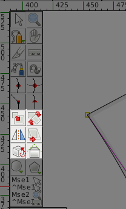](images/transform-tools.png)

 scale تغییر اندازه

بعد از انتخاب گره‌های مورد نظر و سپس انتخاب این دکمه، کافیست موشی را به هر جایی که می‌خواهید تغییر اندازه انجام شود برده و بکشید. برای مثال اگر می‌خواهید گردی حرف واو از چپ کشیده‌تر شود موشی را به سمت راست گردی برده و به راست بکشید. اگر می‌خواهد از هر دو جهت باشد در وسط قرار داده و بکشید. اگر می‌خواهید یکسان و در چهار جهت به یک اندازه بزرگ یا کوچک گردد همزمان کلید shift را نیز نگه دارید.

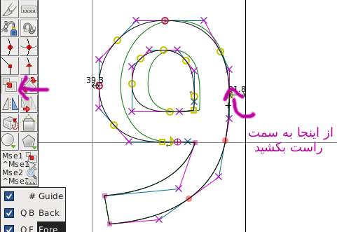

 rotate چرخش

برای چرخش نیز در هر قسمت که نگه داشته‌اید و بکشید چرخش از آنجا صورت می‌گیرد.

 flip برعکس نمودن برای آیینه کردن در جهت افقی یا عمودی.

- یک راه دیگر انتخاب از طریق ctrl+\ یا منوی Transformations->Transform است.

[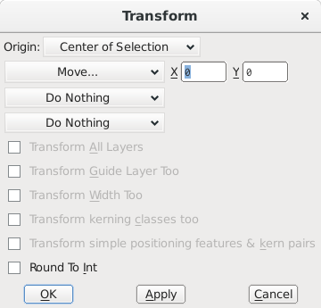](images/transforms.png)

مزیت این روش امکان اعمال آن بر روی هر تعداد گلیف همزمان و همچنین امکان تعیین دقیق از طریق وارد نمودن اعداد مورد نظر می‌باشد. این ابزار به شما کمک فراوانی می‌کند و به دفعات از آن استفاده می‌کنید. برای مثال وقتی می‌خواهید گره یا گره ها یا کل گلیف را به مقدار ۶۵ واحد به چپ جابه‌جا کنید کافیست مقدار x را -۶۵ تنظیم کنید. منفی در جهت چپ است.

برای تغییر اندازه شکل در هر دو جهت به نسبت مساوی، گزینه Scale Uniformly یا تغییر اندازه یکسان را انتخاب نمایید. هر عددی بالای ۱۰۰ آن را بزرگتر و پایین ۱۰۰ آن را کوچکتر می‌کند.

### ترکیب و اتصال اشکال
- فرض کنید شکل واو و حفره آن را جداگانه ساخته‌اید یا از گلیفی دیگر کپی کرده‌اید. چیزی که می‌بینید اینست:

[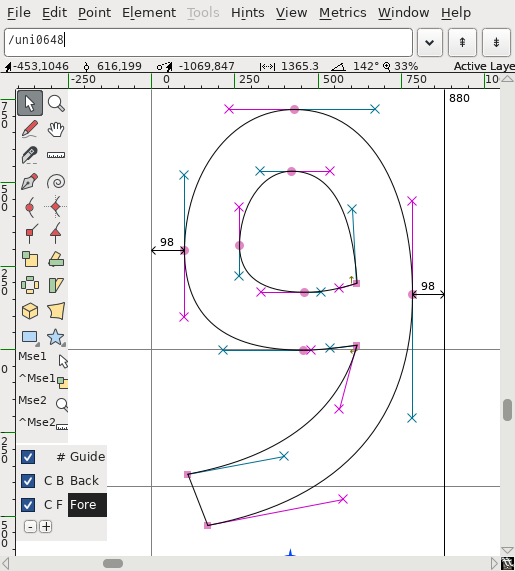](images/correct-direction-init.png)

[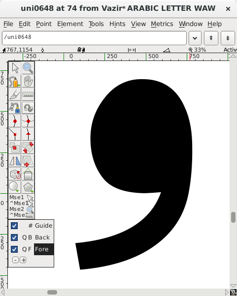](images/correct-direction-before.png)

برای ترکیب این دو منوی Element->Correct Direction را انتخاب کنید.

[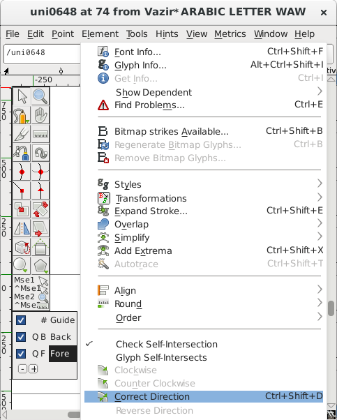](images/correct-direction-menu.png)

[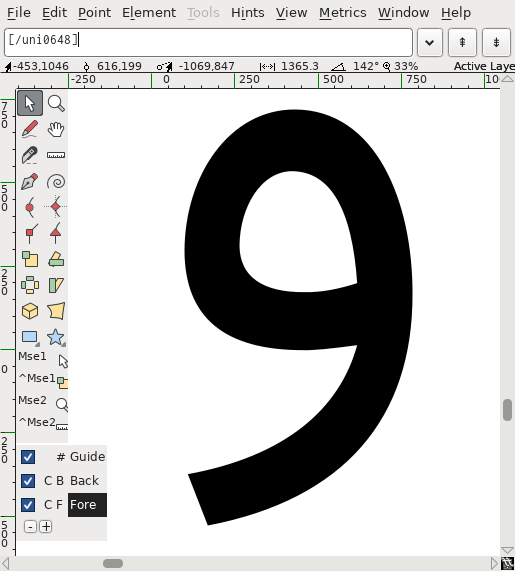](images/correct-direction-after.png)

- قابلیت دیگر فونت‌فورج امکان ترکیب اشکال به شیوه Include، Exclude و ... از طریق منوی Element->Overlap می‌باشد. فرض کنید می‌خواهید این دو شکل را با هم ترکیب یا به تعبیری متصل کنید. 

[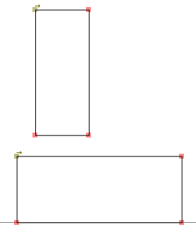](images/overlap-1.png)

[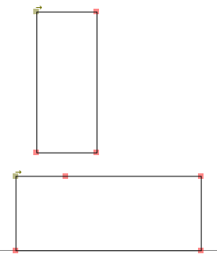](images/overlap-2.png)

[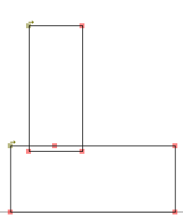](images/overlap-3.png)

[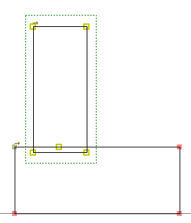](images/overlap-4.png)

[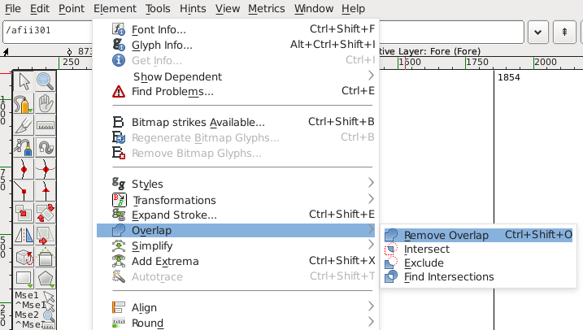](images/overlap-5.png)

[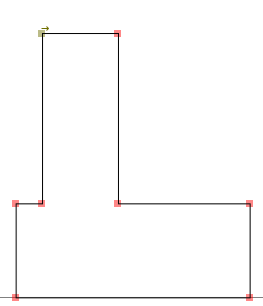](images/overlap-6.png)

توجه داشته باشید که overlap یا روی هم افتادگی بر روی گره ها صورت می گیرد نه خطوط. اگر گره‌ای نباشد عملی انجام نمی‌شود. به عبارتی آن قسمتی که قرار است حذف شود باید بر روی گره‌ای قرار گرفته باشد.

نکته دیگر اینکه این عمل فقط بر روی اشکال بسته یعنی اشکالی که همه گره‌های آن به هم متصل باشند انجام می‌گیرد.

- یک روش دیگر آنست که گره‌های مورد نیاز را در ناحیه اتصالی ایجاد نموده و سپس نقاط اتصالی هر دو شکل را به هم وصل کنید.

[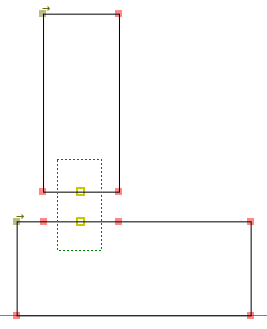](images/connect-3.png)

[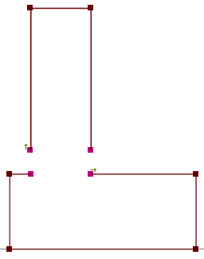](images/connect-4.png)

[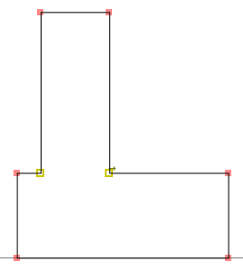](images/connect-5.png)

### گرد کردن گوشه‌ها
طبق آنچه در تصویر آمده می‌توانید لبه های تیز را گرد کنید.

[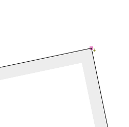](images/round-corner-1.png)

[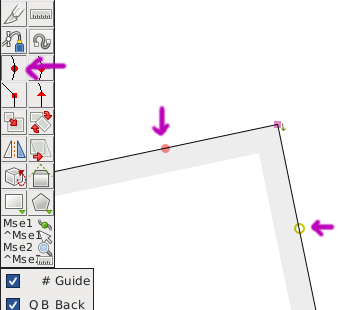](images/round-corner-2.png)

[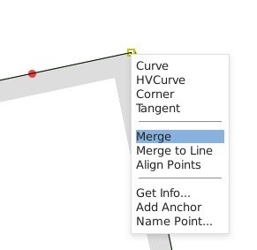](images/round-corner-3.png)

[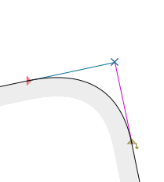](images/round-corner-4.png)

[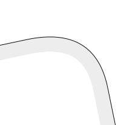](images/round-corner-5.png)

## تغییر ضخامت
این مورد از طریق منوی Element->Style->Change Weight به راحتی امکان پذیر است. کافیست تنها مقدار Embolden By را تعیین و OK کنید تا گلیف ضخیم تر شود. در نسخه ضخیم Vazir این مقدار ۱۰۲ لحاظ گردید. در صورتی که این مقدار را منفی وارد کنید گلیف باریک‌تر می‌گردد. نتیجه اینکه می‌توانید با همین شیوه وزن‌های مختلف قلم مثل Bold، light، Demi-Bold و ... را نیز بسازید.

[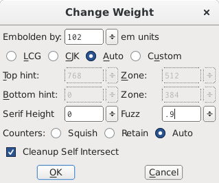](images/change-weight.png)

هر چند انجام این عمل برای کل فونت نکات مهمی دارد که توضیحات گام به گام آن بعدا خواهد آمد.

**سوال**: چرا برخی گلیف‌ها با اینکه عدد مذکور را مثبت وارد می‌کنیم باریک‌تر می‌شوند به جای آنکه ضخیم‌تر شوند؟

به دلیل جهت گلیف می‌باشد. برای اصلاح این ایراد منوی Element->Clockwise را انتخاب نمایید. مطمئن شوید همه گلیف‌ها حتما Clockwise می‌باشند چرا که در هنگام نمایش فونت نهایی، نرم‌افزار موتور رندر برای نمایش حالت ضخیم، آن گلیف را باریک‌تر می‌کند و نه ضخیم‌تر!

## پرسش و پاسخ
خب از مقوله طراحی که بگذریم می‌رسیم به موضوعات و نکات فنی‌.

**سوال**: چرا در بسیاری از گلیف ها عناصر را نمی توان ویرایش کرد مثلا در گلیف ذال امکان ویرایش نقطه یا دال وجود ندارد؟

[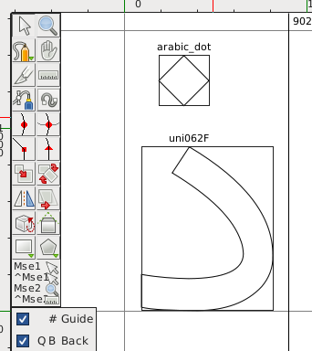](images/reference-1.png)

دلیلش در امکان فوق العاده‌ای در قلم می‌باشد که ما را از انجام تکرار و مکررات و کار بیهوده باز می‌دارد. شما یک بار نقطه فارسی را طراحی کرده و در همه گلیف‌ها از طریق ارجاع به آن استفاده می‌کنید. نتیجه اینکه هر بار نقطه اصلی را تغییر دهید خود به خود در همه گلیف ها اعمال می‌شود. حال همین موضوع را برای گلیف‌های مشابه یکدیگر از جمله ح‌ج‌چ‌خ یا فـ‌قـ یا ب‌پ‌ت‌ث که هم دارای نقطه و هم شکل اصلی یکسان می‌باشند نیز در نظر بگیرید. 
بنابراین شما یک بار گلیف ح را طراحی کرده و در بقیه حروف مشابه آن از ارجاع به آن استفاده می‌کنید. برای این منظور بعد از طراحی گلیف ح، منوی Edit->Copy reference یا کلیدهای ctrl+G را برگزینید. سپس در خانه گلیف مقصد منوی Edit->Paste یا کلیدهای ctrl+V را انتخاب نمایید. برای نقطه هم به همین صورت. به همین سادگی عملا از طراحی یا کپی مجدد بسیاری از گلیف‌های مشابه رهایی می‌یابید.

در تصویر زیر گلیف‌های مرجع که سایرین از روی آنها کپی شده‌اند به رنگ آبی انتخاب گشته‌اند.

[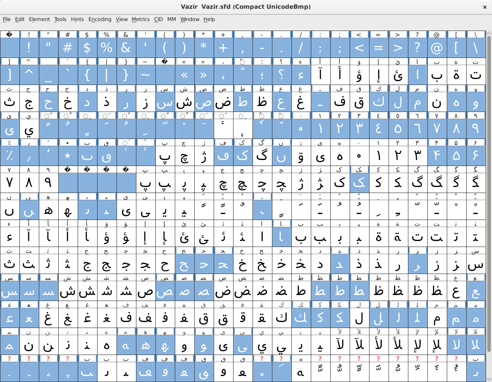](images/reference-3.png)

**سوال**: چرا برخی از گلیف‌ها مثل ـفـ یا ـر از اندازه اصلی طولی گلیف تجاوز کرده‌اند؟

این پیشروی‌ها نواحی اتصال حروف به یکدیگر می‌باشند. دلیلش اطمینان از اینست که گلیف‌های متصل به هم به نوعی در یکدیگر فرو رفته‌اند. این مقدار را کم یا جزئی تعیین کنید.

*نکته: ضخامت خط پایه یا به عبارتی آن قسمت از گلیف که بر روی خط پایه قرار می‌گیرد حتما در همه حروف یکسان باشد.

نکته: ضخامت خط پایه را بیشتر از سایر قسمت‌ها در نظر بگیرید. این عمل علاوه بر افزایش خوانایی به ثبات و خطی بودن شکل قلم نیز کمک فراوانی می‌کند.

**سوال**: چگونه با فونت فورج، قلم را با نام دلخواهم بسازم؟

در منوی Element->Font Info ذیل برگه PS Names نام وزیر را یا نام دلخواه خود جایگزین کنید. در برگه OS/2 توجه داشته باشید که Weight Class آن بر روی عدد صحیح بسته به ضخامت فونت به درستی تعریف شده باشد. حالت معمولی همان 400 Regular می‌باشد. در برگه TTF Names علاوه بر جایگزینی وزیر با نام دلخواه خود، حتما Unique Id را به صورت منحصر به فرد یا یکتا تعریف کنید.
پس از آن با انتخاب منوی File->Generate Fonts فایل فونت خود را با فرمت دلخواه تولید(ایجاد) نمایید.

**سوال**: چگونه همه گلیف‌های عربی را با هم انتخاب کنم؟

با انتخاب منوی Edit->Select->Select By Script و پس از آن انتخاب Arabic.

**سوال**: داده‌های مربوط به نحوه تعریف گلیف‌ها مثل مکان قرارگیری در واژه (ابتدا، وسط، انتها و ...)، لیگچرها، کرنینگ‌ها، شکل‌های جایگزین و ... در کجا ذخیره شده‌اند؟

در جداول lookup در منوی Element -> Font Info -> lookups. توضیح چگونگی تعریف این جداول مفصل می‌باشد. به راهنمای اصلی مراجعه نمایید.

**سوال**: چرا برخی گلیف ها تکرار شده‌اند؟

دلیل آن در تفاوت نوع کیبود و یا زبان (عربی، فارسی، اردو و ...) در سیستم عامل‌ها یا سامانه‌های نوشتاری گوناگون می‌باشد. هر سامانه‌ای، از کد گلیف مورد نظر خود استفاده می‌کند و ممکن است در برخی فونت‌ها شکل‌های آن‌ها متفاوت و در برخی یکسان باشد. شما کافیست به شیوه کپی از طریق ارجاع‌دهی، خیال خود را از بابت یکسان بودن همه گلیف‌های تکراری راحت نمایید.

**سوال**: بحث کرنینگ Kerning در فونت‌فورج به چه صورت است؟

در آینده اگر عمر و توانی بود توضیح می‌دهم.

**سوال**: hinting را چگونه انجام دهم؟

راه اول: هر گلیفی را که می خواهید hinting بر روی آن انجام شود انتخاب نموده و سپس منوی Hints->AutoHint را برگزینید. سپس منوی Hints->AutIntrs. اکنون اطلاعات hinting به رنگ سبز و آبی در گلیف نمایش می‌یابند.

راه دوم: که ساده تر است و شاید در مواردی بتوان گفت خروجی بهتری را می‌دهد استفاده از برنامه ttfautohint می‌باشد. آن را در وب جستجو کنید. کار کردن با آن بسیار ساده است.

**سوال**: چگونه در حین ویرایش گلیف‌ها خروجی کار خود را بر روی یک متن واقعی ببینم؟

[این صفحه تست](test.html) را ذخیره کنید. سپس با یک برنامه ویرایشگر فایل متنی یا html، واژه Myfont را با نام فونت مورد نظر خود جایگزین نموده و ذخیره کنید. فایل فونت خود با پسوند woff یا ttf را در کنار این فایل html (همان پوشه) ذخیره و در نهایت فایل html را با یک مرورگر باز و مشاهده نمایید. هر بار که فایل فونت خود را generate یا تولید کردید این صفحه را مجددا ببینید (refresh).

**سوال**: چرا در گنو/لینوکس وقتی گلیفی را از فونت حذف کردم توی متن‌ها یا صفحات، جای آن به صورت مربع نشان می‌دهد به جای آنکه از سایر فونت‌ها استفاده کند؟

این دستور را اجرا کنید:
fc-cache -f -v

**سوال**: چگونه یک Ligature جدید اضافه کنیم؟
لیگاتور یا لیگِچر ترکیبی از گلیف ها می باشد برای مثال شکل لا ترکیبی از ل و الف است. برای این منظور منوی Element->Adding Slots رو انتخاب کنید و یک خانه گلیف جدید در انتهای جدول گلیف‌هایتان اضافه کنید. در گلیف جدید شکل مورد نظرتان را طراحی و سپس منوی Element->Glyph Info را انتخاب نمایید. حال تحت برگه Ligatures یک ردیف جدید ایجاد و در سمت راست آن به ترتیب کد گلیف‌های مورد نظرتان را وارد کنید. به این ترتیب هر گاه این کدها را پشت سر هم در متنی بنویسید این گلیف به نمایش در می‌آید.

## پیروز باشید
توسط صابر راستی کردار

ایمیل: saber.rastikerdar بر روی جی‌میل

آدرس گیت‌هاب: [getting-started-with-fontforge](https://github.com/rastikerdar/getting-started-with-fontforge)

گفتگو پیرامون این صفحه در وبلاگ: [rastikerdar.blog.ir](http://rastikerdar.blog.ir/post/14)

با تشکر و قدردانی از سازندگان برنامه [FontForge](https://fontforge.github.io)

راهنمای اصلی فونت فورج: [documentation](https://fontforge.github.io/en-US/documentation/)

مجوز این متن و تصاویر: GNU Free Documentation License, CC-by-SA 3.0

نسخه ۰.۲.۱
